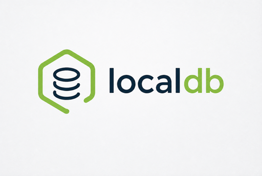

# localdb

<picture>
  <source media="(prefers-color-scheme: dark)" srcset="docs/assets/images/localdb-logo-dark.png">
  
</picture>

[](https://qlty.sh/gh/dokterbob/projects/localdb)
[](https://qlty.sh/gh/dokterbob/projects/localdb)

**Point it at your stuff. Search it instantly — from the terminal, or from any AI assistant you
already use.** Notes, specs, PDFs, Word/Excel/PowerPoint docs, EPUBs, bookmarked pages — one
`localdb index` later, hybrid (keyword + semantic) search returns cited, byte-exact excerpts in
milliseconds. One binary, no Python, no Docker, no cloud, no daemon required for search, no API key.
See [how it compares to GPT4All, Khoj, Basic Memory, and others](#comparison-to-other-tools).

The long-horizon goal is larger: a private, trust-weighted alternative to the feed — your knowledge
enriched by what the people you trust have found, with provenance at every hop. The foundation for
that is built in from day one: content-addressed documents, per-chunk provenance, and stores as
first-class shareable units. See [VISION.md](VISION.md).

**Status:** hybrid search uses real dense embeddings via the default local model
(`pplx-embed-context-v1-0.6b`, ONNX on CPU by default; CoreML ANE/GPU on Apple Silicon macOS
automatically); the first indexing or search operation — including `add`'s auto-index — downloads
~706 MB from HuggingFace (no API key required). The HTTP daemon remains experimental, with no auth.
See [docs/architecture.md#known-gaps](docs/architecture.md#known-gaps) for the full list of what's
not there yet.

---

## Quickstart

1. **Install** (pick one):

   ```bash
   brew install dokterbob/localdb/localdb        # Homebrew, macOS and Linux
   curl --proto '=https' --tlsv1.2 -LsSf https://github.com/dokterbob/localdb/releases/latest/download/localdb-installer.sh | sh
   ```

   See [docs/install.md](docs/install.md) for tarballs, building from source, and completions.

2. **Add and index a folder** — scaffolds `config.yaml` and a `default` store on first use, then
   indexes it:

   ```bash
   localdb add ~/notes
   ```

   The first indexing or search operation (including this auto-index) downloads the ~706 MB default
   embedding model from HuggingFace; later runs reuse the cached copy.

3. **Search:**

   ```bash
   localdb search "some query"
   ```

   Add `--json` for structured `Citation` objects (chunk IDs, provenance hashes, per-component
   scores, document metadata). Scope either command to one store with `-s` — flags go before the
   query, e.g. `localdb search -s notes "some query"` (everything after the first query word is
   treated as query text).

4. **Connect an AI assistant:**

   ```bash
   claude mcp add localdb -- $(which localdb) mcp
   ```

   Use the absolute path — MCP clients spawn the binary directly, without your shell's PATH, so a
   bare `localdb` often fails to launch. See [docs/mcp.md](docs/mcp.md) for other clients and the
   remote/HTTP setup.

---

## Comparison to other tools

localdb is a single dependency-free binary with no external services, hybrid BM25+vector search, a
native MCP server, and structured byte-span citations — a combination no surveyed alternative
(GPT4All, Khoj, Basic Memory, and five others) matches in full. See
[docs/comparison.md](docs/comparison.md) for the full survey, including where localdb is behind (no
GUI yet, single-node, read-only MCP, no knowledge graph).

## Feature highlights

Citeable hybrid search with full provenance, local files/URLs/feeds, an embedded-first design
(nothing needs to be running), five MCP tools, multiple isolated stores, a context-aware local
embedder with CoreML acceleration on Apple Silicon, a libsql backend (DiskANN + FTS5), and `--json`
everywhere. See [docs/comparison.md](docs/comparison.md#what-makes-localdbs-combination-distinctive)
for the detailed rundown.

## MCP hookup

`localdb mcp` exposes five read-only tools (`search`, `list_stores`, `get_document`, `get_chunks`,
`list_documents`) over stdio, or over HTTP at `/mcp` via `localdb serve` — including from another
machine over Tailscale/LAN. See [docs/mcp.md](docs/mcp.md) for full tool schemas, transports, and
example calls.

## Experimental HTTP daemon

`localdb serve` exposes a REST API (`/v1`) plus the same MCP tools at `/mcp`, backed by the same
unified database the CLI uses, with ingestion running through an async job queue with live SSE
progress. It remains experimental and unauthenticated. See [docs/http-api.md](docs/http-api.md) for
the endpoint reference and known limitations.

## Schema migrations

`store-libsql` tracks its schema version explicitly and refuses to open a store whose schema is
behind, ahead, or predates the migration framework (exit 2) rather than silently rebuilding — run
`localdb db status` / `db migrate` / `db downgrade` / `db vacuum`. See
[docs/migrations.md](docs/migrations.md) for the full walkthrough and the migration-authoring guide.

---

## Documentation

| Document                                                   | Contents                                                                                  |
| ---------------------------------------------------------- | ----------------------------------------------------------------------------------------- |
| [docs/install.md](docs/install.md)                         | Full install options, platform notes, shell completion                                    |
| [docs/comparison.md](docs/comparison.md)                   | Comparison to GPT4All, Khoj, Basic Memory, and 5 other adjacent projects                  |
| [docs/release-engineering.md](docs/release-engineering.md) | Release pipeline, binary targets, MSRV, how to cut a release                              |
| [docs/quickstart.md](docs/quickstart.md)                   | Annotated end-to-end walkthrough with real output                                         |
| [docs/configuration.md](docs/configuration.md)             | YAML config schema, paths, store/source options                                           |
| [docs/cli.md](docs/cli.md)                                 | All commands and flags, exit codes, error messages                                        |
| [docs/http-api.md](docs/http-api.md)                       | REST endpoint reference, request/response shapes, limitations                             |
| [docs/mcp.md](docs/mcp.md)                                 | MCP tool schemas, stdio and HTTP transports, remote setup, example calls                  |
| [docs/architecture.md](docs/architecture.md)               | Crate layout, storage, search pipeline overview, known gaps                               |
| [docs/migrations.md](docs/migrations.md)                   | Schema migrations: user-facing `db status`/`migrate`/`downgrade`, and the authoring guide |
| [specs/01-architecture.md](specs/01-architecture.md)       | Workspace layout, embedded-first process model, storage trait                             |
| [specs/02-domain-model.md](specs/02-domain-model.md)       | Store, Source, Document, Block, Chunk, Citation; content-addressed IDs                    |
| [specs/03-config.md](specs/03-config.md)                   | YAML schema, per-store indexing policy, config vs runtime-state split                     |
| [specs/04-search-pipeline.md](specs/04-search-pipeline.md) | Ingestion, chunking, embeddings, BM25+dense RRF                                           |
| [specs/05-surfaces.md](specs/05-surfaces.md)               | CLI command tree, REST API, MCP tools, error taxonomy                                     |
| [specs/06-roadmap.md](specs/06-roadmap.md)                 | Phase ordering, federation, packaging                                                     |
| [VISION.md](VISION.md)                                     | Long-horizon direction: peer-to-peer store sharing                                        |
| [skills/localdb/SKILL.md](skills/localdb/SKILL.md)         | Agent skill definition for localdb-aware AI assistants                                    |
| [CONTRIBUTING.md](CONTRIBUTING.md)                         | Development setup, test gates, contribution guidelines                                    |

---

## License

[AGPL-3.0-or-later](LICENSE). See the license file for full terms.
